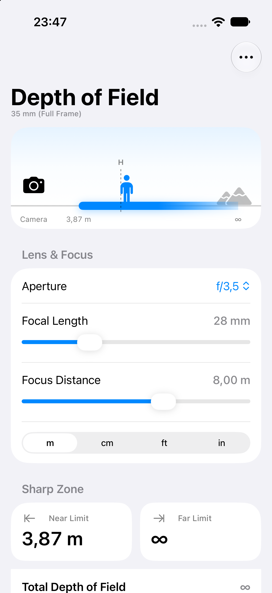

# Depth of Field Calculator

A small SwiftUI app for iOS 27 that calculates the near and far limits of acceptable sharpness, the total depth of field and the hyperfocal distance for a given camera, lens and focus distance.



## Features

- Near and far limits of acceptable sharpness as the headline results, with total depth of field and hyperfocal distance below
- An illustrated scene showing the camera, the subject, the sharp zone on the ground and the hyperfocal mark
- Sensor formats (35 mm full frame, APS-C, Micro Four Thirds, 1-inch) chosen from the "…" menu; the current one is shown under the title
- Standard apertures from f/1.2 to f/64
- Logarithmic sliders for focal length (8–800 mm) and focus distance (0.1–100 m), so short lengths and close distances get fine control
- Focus distance in meters, centimeters, feet or inches; switching units converts the current value
- Results update live as you drag, and the last used values are restored on the next launch
- Runs on iPhone and iPad, light and dark mode

## Requirements

- Xcode 27 or later
- iOS 27 or later

## Project layout

```
depthOfFieldCalculator/
├── App/      DepthOfFieldCalculatorApp.swift   – app entry point
├── Model/    DepthOfField.swift                – pure depth-of-field maths (millimetres in, millimetres out)
│             CameraOptions.swift               – sensor formats, apertures and distance units
│             CalculatorModel.swift             – @Observable state for the screen, persisted in UserDefaults
└── Views/    CalculatorView.swift              – the form with inputs and results
              DepthOfFieldScene.swift           – the camera / subject / sharp-zone illustration
              LogarithmicSlider.swift           – slider with logarithmic travel and value rounding
depthOfFieldCalculatorTests/                    – Swift Testing unit tests for the maths
```

## How it is calculated

With circle of confusion `c`, f-number `N`, focal length `f` and focus distance `s` (all in millimetres):

```
H    = f² / (N · c) + f
near = s · (H − f) / (H + s − 2f)
far  = s · (H − f) / (H − s)      (infinity when s ≥ H)
```

Circle of confusion: 0.030 mm for 35 mm full frame, 0.020 mm for APS-C, 0.015 mm for Micro Four Thirds and 0.011 mm for 1-inch sensors.

## Running the tests

```bash
xcodebuild test -project depthOfFieldCalculator.xcodeproj -scheme depthOfFieldCalculator -destination 'platform=iOS Simulator,name=iPhone 17'
```
